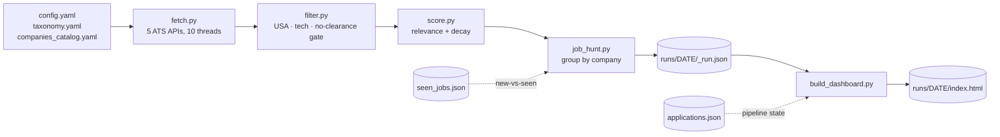
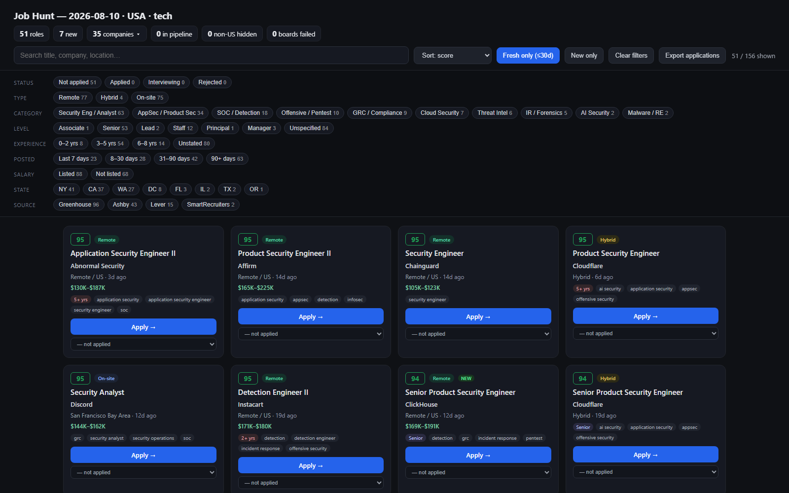
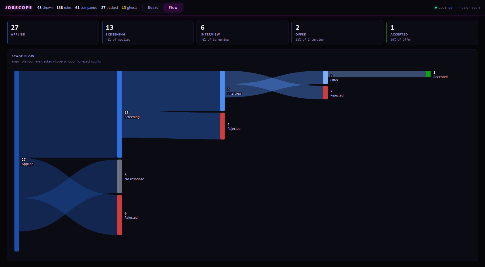

# job-hunt

[](https://github.com/canmenzo/jobscope/actions/workflows/ci.yml)

A Claude Code skill that runs a **USA-only, tech-only** job search end to end:

1. Pulls live postings from **legal, official ATS JSON APIs** — Greenhouse,
   Lever, Ashby, SmartRecruiters, Recruitee and Workday. (No LinkedIn/Indeed
   scraping.)
2. Filters to USA tech roles in your chosen sub-sectors/titles (drops non-US,
   non-tech, and clearance-required roles).
3. Scores each role 0-100 on **how good it is for you** — blending relevance
   (does it match what you're searching for) with fit (could you realistically
   get it), and decaying stale postings.
4. Renders a browsable HTML web app: a dense sortable list, a drag-and-drop
   pipeline board, and a Sankey of how your applications actually flow.

> **You review and apply to everything yourself. This skill never auto-applies,
> and it does not write resumes or cover letters.**

## Invoke it

In Claude Code, just say:

> run my job hunt

On first use (no `config/config.yaml`), Claude walks you through setup —
choosing sub-sectors, target titles, and companies — then runs the search. To
reconfigure later: **"set up my job hunt"**.

## Install

This is a [Claude Code](https://claude.com/claude-code) skill. Clone it into your
Claude skills directory — the folder **must** be named `job-hunt`:

```bash
# macOS / Linux
git clone https://github.com/canmenzo/jobscope.git ~/.claude/skills/job-hunt

# Windows (PowerShell)
git clone https://github.com/canmenzo/jobscope.git "$env:USERPROFILE\.claude\skills\job-hunt"
```

Install the two Python dependencies (Python 3.11+):

```bash
cd ~/.claude/skills/job-hunt          # Windows: %USERPROFILE%\.claude\skills\job-hunt
pip install -r requirements.txt
```

Restart Claude Code so it picks up the skill, then say **"run my job hunt"**.
First run walks you through setup; your answers are saved to `config/config.yaml`
(git-ignored, never shared).

## How it works



Each company is fetched in its own thread with its own try/except, so one dead
board never kills a run — a full ~150-company sweep takes about 20 seconds.

## Run manually

```
python scripts/job_hunt.py                 # full run
python scripts/job_hunt.py --limit 10      # cap companies (test)
python scripts/job_hunt.py --pick "greenhouse:stripe,ashby:workos"
python scripts/job_hunt.py --min-score 70  # raise the relevance bar
python scripts/job_hunt.py --new-only      # only roles unseen on prior runs

python scripts/build_dashboard.py          # build + open the web app
python scripts/build_dashboard.py 2026-08-10   # a specific date
python scripts/build_dashboard.py --no-open
```

## One-click desktop shortcut (Windows)

Prefer a taskbar button over typing? Install a shortcut that runs a fresh hunt
and opens the dashboard:

```powershell
powershell -ExecutionPolicy Bypass -File launcher\install-shortcut.ps1
```

That drops two shortcuts on your Desktop and in the Start Menu. Right-click
either → *Show more options* → **Pin to taskbar**.

- **Job Scope** — runs a fresh hunt. A small console shows fetch progress
  (~20s), then the dashboard opens and the console closes itself.
- **Job Scope (Open)** — rebuilds and opens the last result. No network, about
  a second. Different icon colour so the two are never confused on the taskbar.

The icon is generated, not hand-drawn — regenerate it with
`python launcher/make_icon.py`.

## The dashboard

Every run writes `runs/<DATE>/index.html` and opens it. Zero dependencies —
vanilla JS in a single self-contained file, two tabs.

### Board



A dense **list** on the left and a drag-and-drop **kanban** on the right.

- **List** — one row per role: score, title, company, location, age, salary.
  Sort by any column. Hover a row for **↗ open posting** and **+ move to
  Applied**. The list is your triage queue, so a role **leaves it** the moment
  you move it onto the board; pick its stage in the **Stage** filter to see it
  again.
- **Kanban** — Applied · Screening · Interview · Offer. **Drag a row from the
  list onto a column** to start tracking it, drag cards between columns as
  things progress, and drag one **back onto the list** to untrack it. Every
  move raises an **Undo** toast.
- **Closed strip** — Accepted · Rejected · No response. Also drop targets.
- Click a kanban card to open an inline **note**; the card shows a ✎ when it
  has one. The date you first move something to Applied is recorded.
- **Filters** — a single thin row above the list: search (`/` focuses it),
  **Fresh ≤30d** (on by default), Stage, Type, Category, and **More** for
  Level, Experience, Posted, Salary, State, Source and Company. Every dropdown
  is searchable and multi-select, with counts that account for the other active
  filters. OR within a group, AND across groups.
- Filters and the active tab persist to the URL hash and `localStorage`, so a
  reload — or the next run's dashboard — returns to the same view. Copy the URL
  to bookmark a slice.

### Flow



A conversion strip (how many made it to each stage, and what share of the
previous one) above a full-width **Sankey** of how roles actually moved.
Drop-offs branch off the spine at the stage they happened, so the shape shows
*where* you lose momentum. Hover any ribbon or node for exact counts.

The flow always covers every tracked role — your pipeline shouldn't shrink
because a posting aged past the freshness filter.

*(Both screenshots use sample data — a fresh install starts empty.)*

## Application tracking

Stages are **Not applied → Applied → Screening → Interview → Offer →
Accepted**, with **Rejected** and **No response** as exits. Every change is
timestamped into a per-role history, which is what the Sankey draws.

State lives in browser `localStorage`, so it survives rebuilds and carries
across runs. A dashboard built later is seeded from `applications.json` in the
skill root if that file exists.

## Visa sponsorship

Applying to a posting that will not sponsor is wasted effort, and the posting
almost always says so — buried in boilerplate. Every description is scanned for
both refusals ("unable to sponsor", "must be authorized to work without
sponsorship", "US citizens or permanent residents") and offers ("visa
sponsorship is available", "we will sponsor H-1B"). Refusals win, because every
refusal contains the words of an offer.

Roles are tagged **NO SPONSOR** or **SPONSORS**, and **Sponsorship** is a facet
under More. Set `needs_sponsorship: true` in your profile and a role that rules
sponsorship out is scored as unreachable — it stays visible, because that
boilerplate is sometimes stale and only you can judge it.

The negative pattern is deliberately narrow: a false "no" hides a job you could
have had, which is worse than leaving it unknown.

## Ghost-job detection

Two signals a single snapshot can't give you, both derived from `seen_jobs.json`
across runs:

- **Open duration** — how long *this tool* has watched a posting stay open,
  independent of (and more trustworthy than) the board's own posted date.
- **Relisting** — the same company + title reappearing under a new posting id.
  A req that keeps getting torn down and reposted is the classic evergreen /
  always-hiring pipeline, not a live opening.

Either one earns a **GHOST** tag (hover for the reason); the **Ghosts** button
filters to them so you can decide whether they're worth your time.

Separately, the same role opened once per city is **merged into one row** with a
"N LOC" tag, so a company posting to five metros stops flooding the list.

## The score (0-100)

One number: **how good this role is for you.** It blends two questions that a
job board usually conflates.

### Relevance — is this the kind of job you asked for?

| Band | Meaning |
|---|---|
| **72-100** | A selected title phrase appears in the job title. Scales with *coverage*, so a clean "Detection Engineer" outranks "Staff Distributed Systems Detection Engineer, Platform". |
| **55-63** | A sub-sector keyword appears in the job title — right area, wrong/unknown title. |
| **42** | Match only in the description. Below the default cutoff. |

Counting more keywords never inflates the score. Then four opt-in penalties:

- **Freshness** (`freshness: true`) — no penalty for 21 days, then decaying to
  −22 by 5 months old.
- **Experience** (`max_yoe: N`) — −5 per year the posting demands above `N`,
  capped at −20. Years are parsed from the description, taking the *lowest*
  stated bar so a reachable role is never wrongly buried.
- **Seniority** (`downrank_levels`) — −25 for listed levels.
- **Exclusion** (`exclude_levels`) — scored 0, dropped entirely.

### Fit — could you realistically get it?

Relevance alone recommends jobs you cannot get: a Staff Product Security
Engineer wanting 8 years scores 95 to a second-year analyst, because the title
matches. Fit is the missing half, computed from `config/profile.yaml`:

| Component | Weight | What it reads |
|---|---|---|
| Experience | 40 | Years the posting asks for vs yours |
| Seniority | 25 | The title's level vs the levels you target |
| Skills | 25 | How much of your toolkit the posting actually names |
| Pay band | 10 | A listed floor far above your target signals a senior role |

The displayed score is a blend, weighted toward fit, and the score chip is
tinted by reachability — **green** you clear comfortably, **amber** is a
stretch, **red** is a reach. **Hover any score** to see what pulled that one
down ("wants 8+ yrs (you have 3); staff level, a stretch").

Without `config/profile.yaml` fit is off and the score is pure relevance, so the
tool still works before you onboard. Set it up by asking Claude to read your
resume — see `config/profile.example.yaml` for the schema.

Default `min_score` is **55**, so you see title matches by default.

## Add or change companies

Edit `config/companies_catalog.yaml` — slugs grouped by ATS source. The slug is
the identifier in that ATS's public URL:

- Greenhouse: `job-boards.greenhouse.io/<slug>`
- Lever: `jobs.lever.co/<slug>`
- Ashby: `jobs.ashbyhq.com/<slug>`
- SmartRecruiters: `jobs.smartrecruiters.com/<slug>`
- Recruitee: `<slug>.recruitee.com`
- Workday: `tenant:wdN:site`, read off the careers URL —
  `https://capitalone.wd12.myworkdayjobs.com/Capital_One` becomes
  `capitalone:wd12:Capital_One`

Workday is where the enterprise, finance, insurance and MSSP security roles
live; the startup boards skew senior and carry almost no entry-level security
work. Its list endpoint has no descriptions, so those postings are hydrated
after the title gate — the request count tracks matches, not employer size.

A failing slug never crashes the run. The catalog keeps a commented list of
slugs already probed and confirmed dead, so they don't get re-added. Companies on
Workday/iCIMS/Google careers aren't reachable by these public APIs.

## Development

```bash
pip install -r requirements.txt -r requirements-dev.txt
pytest -q          # 152 tests: location parsing, the filter gate, scoring,
                   # freshness decay, YOE + salary extraction, ghost/relist
                   # detection, duplicate merging
ruff check scripts tests
```

CI runs both on every push against Python 3.11, 3.12, and 3.13.

## Layout

```
job-hunt/
  SKILL.md                  workflow Claude follows (setup + run)
  README.md                 this file
  requirements.txt          runtime deps (requests, pyyaml)
  requirements-dev.txt      pytest, ruff
  pyproject.toml            pytest + ruff config
  config/
    config.yaml             your choices (written by setup, git-ignored)
    config.example.yaml     schema reference
    profile.yaml            who you are (git-ignored, drives fit)
    profile.example.yaml    profile schema reference
    taxonomy.yaml           sub-sectors -> titles -> keywords
    companies_catalog.yaml  companies by ATS source (+ known-dead slugs)
  scripts/
    fetch.py                pull the ATS APIs in parallel (+ per-company status)
    filter.py               USA + selected-sector gate, location classification
    score.py                relevance, freshness + seniority + YOE
    fit.py                  reachability for YOU, from config/profile.yaml
    job_hunt.py             orchestrator (run this)
    build_dashboard.py      build + open the web app
    dashboard_assets.py     the page's CSS + JS (inlined, no CDN)
  docs/                     README screenshots
  launcher/
    make_icon.py            renders jobscope.ico
    jobscope.ico            taskbar icon
    run-jobscope.bat        hunt + build + open, with progress
    open-dashboard.bat      reopen the last result, no fetching
    install-shortcut.ps1    creates the Desktop/Start Menu shortcut
  tests/                    pytest suite
  runs/<DATE>/_run.json     grouped results
  runs/<DATE>/index.html    the dashboard
  seen_jobs.json            new-vs-seen cache across runs
  applications.json         optional pipeline-state seed (exported from the UI)
```
