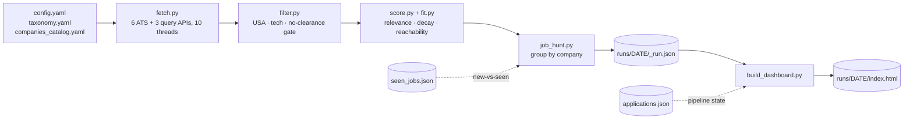

# job-hunt

[](https://github.com/canmenzo/jobscope/actions/workflows/ci.yml)

A Claude Code skill that runs a **USA-only, tech-only** job search end to end:

1. Pulls live postings from **legal, official JSON APIs** — the ATS boards
   (Greenhouse, Lever, Ashby, SmartRecruiters, Recruitee, Workday) plus
   role-based job-search APIs (The Muse, Adzuna, USAJOBS) that reach employers
   no curated catalog contains. (No LinkedIn/Indeed scraping.)
2. Filters to USA tech roles in your chosen sub-sectors/titles, dropping
   non-US, non-tech and clearance-required postings.
3. Scores each role 0-100 on **how good it is for you** — relevance (does it
   match what you asked for) blended with fit (could you realistically get it).
4. Renders a browsable HTML web app: a dense sortable list, a drag-and-drop
   pipeline board, and a Sankey of how your applications actually flow.

> **You review and apply to everything yourself. This skill never auto-applies,
> and it does not write resumes or cover letters.**

## Invoke it

In Claude Code, say **"run my job hunt"**. On first use Claude walks you through
setup — sub-sectors, target titles, companies — then runs the search. To
reconfigure later: **"set up my job hunt"**.

## Install

Clone it into your Claude skills directory. The folder **must** be named
`job-hunt`:

```bash
# macOS / Linux
git clone https://github.com/canmenzo/jobscope.git ~/.claude/skills/job-hunt

# Windows (PowerShell)
git clone https://github.com/canmenzo/jobscope.git "$env:USERPROFILE\.claude\skills\job-hunt"
```

Then install the two dependencies (Python 3.11+) and restart Claude Code:

```bash
cd ~/.claude/skills/job-hunt          # Windows: %USERPROFILE%\.claude\skills\job-hunt
pip install -r requirements.txt
```

Your answers are saved to `config/config.yaml`, which is git-ignored — as are
your profile, your pipeline and every run.

## How it works



Every board is fetched in its own thread with its own try/except, so one dead
board never kills a run. A full sweep — ~250 boards, ~25k postings pulled, ~600
kept — takes about 90 seconds end to end.

```
python scripts/job_hunt.py                 # full run
python scripts/job_hunt.py --limit 10      # cap companies (test)
python scripts/job_hunt.py --pick "greenhouse:stripe,ashby:workos"
python scripts/job_hunt.py --min-score 70  # raise the relevance bar
python scripts/job_hunt.py --new-only      # only roles unseen on prior runs

python scripts/build_dashboard.py          # build + open the web app
python scripts/build_dashboard.py 2026-08-14   # a specific date
python scripts/build_dashboard.py --no-open
```

On Windows, `powershell -ExecutionPolicy Bypass -File launcher\install-shortcut.ps1`
adds two shortcuts (Desktop + Start Menu, pinnable to the taskbar): **Job Scope**
runs a fresh hunt, **Job Scope (Open)** just reopens the last result.

## The dashboard

Every run writes `runs/<DATE>/index.html` and opens it — vanilla JS in a single
self-contained file, no dependencies, two tabs.

### Board


A dense **list** on the left, a drag-and-drop **kanban** on the right.

- **List** — score, title, company, location, age, salary; sortable by any
  column. It is your triage queue, so a role **leaves it** once you move it onto
  the board; the **Stage** filter brings it back.
- **Kanban** — Applied · Screening · Interview · Offer, with a closed strip for
  Accepted · Rejected · No response. Drag a row onto a column to track it, drag
  it back to untrack. Every move raises an **Undo** toast. A card's title links
  to the posting; clicking elsewhere on it opens an inline note.
- **Filters** — one thin row: search (`/` focuses it), **Fresh ≤30d** (on by
  default), Stage, Type, Category, State, and **More** for Level, Experience,
  Posted, Salary, Source, Company and Sponsorship. Searchable multi-selects with
  counts; OR within a group, AND across groups.
- **State** answers the location question Type can't. A role remote *anywhere*
  in the US is tied to no state, so picking one would hide it — those sit at the
  top of the menu as **Remote / US**, and a state chosen without them says so in
  a toast. A role posted in several cities answers to each of their states.
- Filters and the active tab persist to the URL hash and `localStorage`, so a
  reload — or the next run — returns to the same view.

### Coverage

Two header stats open a sheet, because *what a run searched* is a different
question from *what it found*:

- **companies** — every board touched, matched or not, with its match count and
  a careers link. Empty and failed boards say so on their own face.
- **sources** — every provider available, what each brought in, and for the ones
  switched off, why. A source waiting on a free API key looks exactly like a
  source with no jobs otherwise.

Clicking a card that has roles filters the list down to it.

### Flow


A conversion strip above a full-width **Sankey** of how roles actually moved.
Drop-offs branch off the spine where they happened, so the shape shows *where*
you lose momentum. It always covers every tracked role — your pipeline shouldn't
shrink because a posting aged past the freshness filter.

The Flow header also exports **Pipeline CSV** (everything you track: stage,
dates, path, notes) and **Roles CSV** (what currently passes your filters). Both
open cleanly in Excel and neutralise cells starting with `=`, `+`, `-` or `@` —
job titles come from third parties.

*(Both screenshots use sample data — a fresh install starts empty.)*

## Application tracking

Stages are **Not applied → Will apply → Applied → Screening → Interview →
Offer → Accepted**, with **Rejected** and **No response** as exits. Every change
is timestamped into a per-role history, which is what the Sankey draws. State
lives in browser `localStorage` and survives rebuilds; a dashboard built later is
seeded from `applications.json` in the skill root if that file exists.

## Visa sponsorship

Applying to a posting that will not sponsor is wasted effort, and the posting
almost always says so — buried in boilerplate. Descriptions are scanned for both
refusals ("unable to sponsor", "must be authorized to work without sponsorship")
and offers ("visa sponsorship is available"). Refusals win, because every refusal
contains the words of an offer.

Roles are tagged **NO SPONSOR** or **SPONSORS**, and Sponsorship is a facet. Set
`needs_sponsorship: true` in your profile and a role that rules it out is scored
as unreachable — but stays visible, because that boilerplate is sometimes stale
and only you can judge it. The negative pattern is deliberately narrow: a false
"no" hides a job you could have had.

## Ghost-job detection

Two signals a single snapshot can't give you, both from `seen_jobs.json` across
runs: **open duration** (how long *this tool* has watched a req stay open, more
trustworthy than the board's own posted date) and **relisting** (the same
company + title back under a new posting id — the classic evergreen pipeline).
Either earns a **GHOST** tag, and the Ghosts button hides them.

Separately, the same role opened once per city is **merged into one row** with an
"N LOC" tag, so a company posting to five metros stops flooding the list.

## The score (0-100)

One number: **how good this role is for you**, blending two questions a job
board usually conflates.

### Relevance — is this the kind of job you asked for?

| Band | Meaning |
|---|---|
| **72-100** | A selected title phrase appears in the job title. Scales with *coverage*, so a clean "Detection Engineer" outranks "Staff Distributed Systems Detection Engineer, Platform". |
| **55-63** | A sub-sector keyword appears in the job title — right area, wrong/unknown title. |
| **42** | Match only in the description. Below the default cutoff. |

Counting more keywords never inflates the score. Then four opt-in penalties:
**freshness** (nothing for 21 days, decaying to −22 by 5 months), **experience**
(−5 per year demanded above `max_yoe`, capped at −20), **seniority** (−25 for
`downrank_levels`) and **exclusion** (`exclude_levels`, scored 0).

### Fit — could you realistically get it?

Relevance alone recommends jobs you cannot get: a Staff Product Security
Engineer wanting 8 years scores 95 to a second-year analyst, because the title
matches. Fit is the missing half, computed from `config/profile.yaml`:

| Component | Weight | What it reads |
|---|---|---|
| Experience | 40 | Years the posting asks for vs yours |
| Seniority | 25 | The title's level vs the levels you target |
| Skills | 25 | How much of your toolkit the posting actually names |
| Pay band | 10 | A listed floor far above your target signals a senior role |

Two rules stop fit from flattering a posting:

**Missing data scores zero.** About half of all postings state no years and no
salary, and earlier versions rewarded that silence — first with most of the
weight, then by shrinking the score toward a neutral 50. Both quietly lifted
uninformative listings. Now what a posting doesn't state earns nothing, exactly
like a bad answer, and the reasons name the deduction. The weights sum to 100, so
a component's weight is the points forfeited: no pay range −10, no readable
description −25. The one thing still inferred is an unstated years bar, from what
the title implies (senior ⇒ ~5 years, an unlevelled title ⇒ mid).

**Common skills are not evidence.** `python`, `git` and `docker` appear in almost
every engineering posting, so raw hit counts let any generic role max out the
skills component. Each run measures how often your skills actually occur across
the postings it pulled and weights the rare ones accordingly, with full marks
pegged to the top decile of that run's own matches.

The displayed score is a blend weighted toward fit, and the chip is tinted by
reachability — **green** you clear comfortably, **amber** is a stretch, **red**
is a reach. **Hover any score** for what pulled that one down ("wants 8+ yrs (you
have 3); staff level, a stretch; −10 for what it does not state (no pay range)").

Without `config/profile.yaml` fit is off and the score is pure relevance, so the
tool works before you onboard. Set it up by asking Claude to read your resume —
see `config/profile.example.yaml`. Default `min_score` is **55**.

## Add or change companies

Edit `config/companies_catalog.yaml` — slugs grouped by ATS source. The slug is
the identifier in that ATS's public URL:

- Greenhouse: `job-boards.greenhouse.io/<slug>`
- Lever: `jobs.lever.co/<slug>`
- Ashby: `jobs.ashbyhq.com/<slug>`
- SmartRecruiters: `jobs.smartrecruiters.com/<slug>`
- Recruitee: `<slug>.recruitee.com`
- Workday: `tenant:wdN:site`, read off the careers URL —
  `https://capitalone.wd12.myworkdayjobs.com/Capital_One` becomes
  `capitalone:wd12:Capital_One`

A failing slug never crashes the run, and the catalog keeps a commented list of
slugs already probed and confirmed dead so they don't get re-added.

## Reaching past the catalog

A hand-curated list can only contain companies somebody thought to add, which is
why one that starts with security vendors and AI labs keeps returning security
vendors and AI labs. **Broad sources** search by role instead of by company, so
the regional bank, the hospital system, the 40-person MSP and the federal agency
show up — and that is where most of the roles a mid-level candidate can actually
clear are posted.

```yaml
broad_sources:
  muse: true            # The Muse — no key needed
  adzuna: false         # free key: https://developer.adzuna.com/
  adzuna_app_id: "..."
  adzuna_app_key: "..."
  usajobs: false        # free key: https://developer.usajobs.gov/apirequest/
  usajobs_email: "you@example.com"
  usajobs_key: "..."

broad_queries:          # defaults to `titles`; plainer phrasing works better
  - SOC Analyst
  - Information Security Analyst
```

Sources with no key are skipped silently, so the tool runs without signing up for
either. Adzuna returns truncated descriptions, so its structured salary fields
are used instead. Workday is where the enterprise, finance, insurance and MSSP
security roles live — its list endpoint carries no descriptions, so those
postings are hydrated after the title gate, keeping the request count tied to
matches rather than employer size.

## Development

```bash
pip install -r requirements.txt -r requirements-dev.txt
pytest -q          # 191 tests: location parsing, the filter gate, scoring,
                   # fit, extraction, ghost/relist detection, merging, sources
ruff check scripts tests
```

CI runs both on every push against Python 3.11, 3.12 and 3.13.

## Layout

```
job-hunt/
  SKILL.md                  workflow Claude follows (setup + run)
  config/
    config.yaml             your choices (written by setup, git-ignored)
    profile.yaml            who you are (git-ignored, drives fit)
    *.example.yaml          schema reference for both of the above
    taxonomy.yaml           sub-sectors -> titles -> keywords
    companies_catalog.yaml  companies by ATS source (+ known-dead slugs)
  scripts/
    fetch.py                pull the APIs in parallel (+ per-source status)
    filter.py               USA + selected-sector gate, location classification
    score.py                relevance, freshness + seniority + YOE
    fit.py                  reachability for YOU, from config/profile.yaml
    job_hunt.py             orchestrator (run this)
    build_dashboard.py      build + open the web app
    dashboard_assets.py     the page's CSS + JS (inlined, no CDN)
  launcher/                 Windows icon, .bat runners, shortcut installer
  tests/                    pytest suite
  docs/                     README screenshots
  runs/<DATE>/              _run.json (grouped results) + index.html
  seen_jobs.json            new-vs-seen cache across runs
  applications.json         optional pipeline-state seed (exported from the UI)
```
