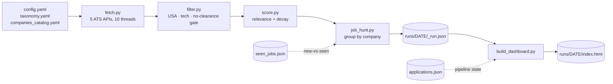

# job-hunt

[](https://github.com/canmenzo/jobscope/actions/workflows/ci.yml)

A Claude Code skill that runs a **USA-only, tech-only** job search end to end:

1. Pulls live postings from **legal, official ATS JSON APIs** — Greenhouse,
   Lever, Ashby, SmartRecruiters, Recruitee. (No LinkedIn/Indeed scraping.)
2. Filters to USA tech roles in your chosen sub-sectors/titles (drops non-US,
   non-tech, and clearance-required roles).
3. Scores each role 0-100 for relevance, decaying stale postings and roles that
   demand far more experience than you have.
4. Renders a browsable HTML web app with faceted filtering and application
   tracking.

> **You review and apply to everything yourself. This skill never auto-applies,
> and it does not write resumes or cover letters.**


## Invoke it

In Claude Code, just say:

> run my job hunt

On first use (no `config/config.yaml`), Claude walks you through setup —
choosing sub-sectors, target titles, and companies — then runs the search. To
reconfigure later: **"set up my job hunt"**.

## Install

This is a [Claude Code](https://claude.com/claude-code) skill. Clone it into your
Claude skills directory — the folder **must** be named `job-hunt`:

```bash
# macOS / Linux
git clone https://github.com/canmenzo/jobscope.git ~/.claude/skills/job-hunt

# Windows (PowerShell)
git clone https://github.com/canmenzo/jobscope.git "$env:USERPROFILE\.claude\skills\job-hunt"
```

Install the two Python dependencies (Python 3.11+):

```bash
cd ~/.claude/skills/job-hunt          # Windows: %USERPROFILE%\.claude\skills\job-hunt
pip install -r requirements.txt
```

Restart Claude Code so it picks up the skill, then say **"run my job hunt"**.
First run walks you through setup; your answers are saved to `config/config.yaml`
(git-ignored, never shared).

## How it works



Each company is fetched in its own thread with its own try/except, so one dead
board never kills a run — a full ~150-company sweep takes about 20 seconds.

## Run manually

```
python scripts/job_hunt.py                 # full run
python scripts/job_hunt.py --limit 10      # cap companies (test)
python scripts/job_hunt.py --pick "greenhouse:stripe,ashby:workos"
python scripts/job_hunt.py --min-score 70  # raise the relevance bar
python scripts/job_hunt.py --new-only      # only roles unseen on prior runs

python scripts/build_dashboard.py          # build + open the web app
python scripts/build_dashboard.py 2026-08-10   # a specific date
python scripts/build_dashboard.py --no-open
```

## One-click desktop shortcut (Windows)

Prefer a taskbar button over typing? Install a shortcut that runs a fresh hunt
and opens the dashboard:

```powershell
powershell -ExecutionPolicy Bypass -File launcher\install-shortcut.ps1
```

That drops **Job Scope** on your Desktop and in the Start Menu. Right-click it →
*Show more options* → **Pin to taskbar** (or just drag it onto the taskbar).

Clicking it opens a small console showing fetch progress (~20s), then launches
the dashboard in your browser and closes itself. If the run fails, the window
stays open with the error.

The icon is generated, not hand-drawn — regenerate it with
`python launcher/make_icon.py`.

## The dashboard

Every run writes `runs/<DATE>/index.html` and opens it. Zero dependencies —
vanilla JS in a single self-contained file.

- **Stats header** — roles, new, companies, in-pipeline, non-US hidden, failed
  boards. All counts update live as you filter. Click **companies** for a
  multi-select company panel.
- **Facet bar** — Status, Type, Category, Level, Experience, Posted, Salary,
  State, Source. Multi-select within a group is OR, across groups is AND.
- **Role cards** — relevance score, remote/hybrid/on-site pill, company, region,
  posting age, extracted salary range, required-years chip, matched keywords,
  and an **Apply** link.
- **Fresh only (≤30d)** — on by default. Long-open reqs are usually filled or
  never existed; this keeps them out of your way without deleting them.
- Live search, sort (score / new first / company A–Z), and clear-filters.
- Companies that searched OK but matched nothing, collapsed at the bottom.
- **Failed boards** at the very bottom with the reason and a careers link, so
  dead slugs are easy to spot and prune.

## Application tracking

Each card has a status dropdown: **not applied → applied → interviewing →
rejected**. Applied cards get a green border, interviewing gets amber, rejected
dims out. Status is a facet, so "show me everything I've applied to" is one click.

State lives in browser `localStorage`, so it survives rebuilds and carries across
runs. **Export applications** downloads the whole set as `applications.json`;
drop that file in the repo root and every future dashboard is seeded from it
(useful for backup, or for moving to another machine/browser).

## Relevance score (0-100)

Base score — how well the posting matches what you asked to search for:

| Band | Meaning |
|---|---|
| **72-100** | A selected title phrase appears in the job title. Scales with *coverage*, so a clean "Detection Engineer" outranks "Staff Distributed Systems Detection Engineer, Platform". |
| **55-63** | A sub-sector keyword appears in the job title — right area, wrong/unknown title. |
| **42** | Match only in the description. Below the default cutoff. |

Counting more keywords never inflates the score. Then four opt-in penalties:

- **Freshness** (`freshness: true`) — no penalty for 21 days, then decaying to
  −22 by 5 months old.
- **Experience** (`max_yoe: N`) — −5 per year the posting demands above `N`,
  capped at −20. Years are parsed from the description, taking the *lowest*
  stated bar so a reachable role is never wrongly buried.
- **Seniority** (`downrank_levels`) — −25 for listed levels.
- **Exclusion** (`exclude_levels`) — scored 0, dropped entirely.

Default `min_score` is **55**, so you see title matches by default.

## Add or change companies

Edit `config/companies_catalog.yaml` — slugs grouped by ATS source. The slug is
the identifier in that ATS's public URL:

- Greenhouse: `job-boards.greenhouse.io/<slug>`
- Lever: `jobs.lever.co/<slug>`
- Ashby: `jobs.ashbyhq.com/<slug>`
- SmartRecruiters: `jobs.smartrecruiters.com/<slug>`
- Recruitee: `<slug>.recruitee.com`

A failing slug never crashes the run. The catalog keeps a commented list of
slugs already probed and confirmed dead, so they don't get re-added. Companies on
Workday/iCIMS/Google careers aren't reachable by these public APIs.

## Development

```bash
pip install -r requirements.txt -r requirements-dev.txt
pytest -q          # 65 tests: location parsing, the filter gate, scoring,
                   # freshness decay, YOE + salary extraction
ruff check scripts tests
```

CI runs both on every push against Python 3.11, 3.12, and 3.13.

## Layout

```
job-hunt/
  SKILL.md                  workflow Claude follows (setup + run)
  README.md                 this file
  requirements.txt          runtime deps (requests, pyyaml)
  requirements-dev.txt      pytest, ruff
  pyproject.toml            pytest + ruff config
  config/
    config.yaml             your choices (written by setup, git-ignored)
    config.example.yaml     schema reference
    taxonomy.yaml           sub-sectors -> titles -> keywords
    companies_catalog.yaml  companies by ATS source (+ known-dead slugs)
  scripts/
    fetch.py                pull the ATS APIs in parallel (+ per-company status)
    filter.py               USA + selected-sector gate, location classification
    score.py                0-100 relevance, freshness + seniority + YOE
    job_hunt.py             orchestrator (run this)
    build_dashboard.py      build + open the web app
  launcher/
    make_icon.py            renders jobscope.ico
    jobscope.ico            taskbar icon
    run-jobscope.bat        hunt + build + open, with progress
    install-shortcut.ps1    creates the Desktop/Start Menu shortcut
  tests/                    pytest suite
  runs/<DATE>/_run.json     grouped results
  runs/<DATE>/index.html    the dashboard
  seen_jobs.json            new-vs-seen cache across runs
  applications.json         optional pipeline-state seed (exported from the UI)
```
