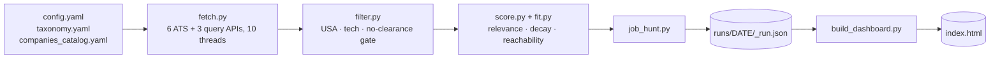

# job-hunt

[](https://github.com/canmenzo/jobscope/actions/workflows/ci.yml)

A Claude Code skill that runs a **USA-only, tech-only** job search end to end.
It pulls live postings from legal, official JSON APIs — the ATS boards
(Greenhouse, Lever, Ashby, SmartRecruiters, Recruitee, Workday) plus role-based
job-search APIs (The Muse, Adzuna, USAJOBS) that reach employers no curated
catalog contains — filters them to USA tech roles you actually asked for, scores
each one on **how good it is for you**, and opens a browsable dashboard with a
drag-and-drop pipeline board. No LinkedIn/Indeed scraping.

> **You review and apply to everything yourself. This skill never auto-applies,
> and it does not write resumes or cover letters.**

## Install

In Claude Code:

```
/plugin marketplace add canmenzo/jobscope
/plugin install jobscope@jobscope
```

Then install the two Python dependencies (3.11+) and restart Claude Code:

```bash
pip install requests pyyaml
```

<details>
<summary>Manual install without the plugin system</summary>

Clone into your skills directory — the folder **must** be named `job-hunt`:

```bash
git clone https://github.com/canmenzo/jobscope.git ~/.claude/skills/job-hunt
# Windows: git clone https://github.com/canmenzo/jobscope.git "$env:USERPROFILE\.claude\skills\job-hunt"
cd ~/.claude/skills/job-hunt && pip install -r requirements.txt
```
</details>

## Set it up

Say **"set up my job hunt"**. Claude asks for:

- **sub-sectors** (cybersecurity, SWE, data/ML, devops, IT, product, QA),
  **target titles**, and **companies** — `all` is the sane default, since boards
  that return nothing are surfaced in the dashboard and easy to prune later;
- your **resume**, which it reads for years, tools and certifications, plus the
  four things a resume cannot tell it: target salary, target levels, remote
  preference, and whether you need visa sponsorship.

That writes `config/config.yaml` and `config/profile.yaml`. Both are git-ignored,
along with your pipeline and every run. The profile is optional — without it the
score is relevance only.

## Run it

Say **"run my job hunt"**, or drive the pipeline directly:

```
python scripts/job_hunt.py                 # full run (--limit, --pick, --min-score, --new-only)
python scripts/build_dashboard.py          # build + open the web app (--no-open, or a date)
```

A full sweep — ~250 boards, ~25k postings pulled, ~600 kept — takes about 90
seconds. On Windows, `launcher\install-shortcut.ps1` adds two taskbar-pinnable
shortcuts: one runs a fresh hunt, one just reopens the last result.



Each board is fetched in its own thread with its own try/except, so one dead
board never kills a run.

## The dashboard


Vanilla JS in one self-contained file. A dense sortable **list** on the left, a
drag-and-drop **kanban** on the right (Applied · Screening · Interview · Offer,
plus a closed strip). The list is a triage queue, so a role leaves it once you
track it; every move raises an Undo toast, and stage history is timestamped into
`localStorage`, seeded from `applications.json` if present.

- **Filters** — search, Fresh ≤30d (on by default), Stage, Type, Category, State
  and More (Level, Experience, Posted, Salary, Source, Company, Sponsorship).
  Searchable multi-selects; OR within a group, AND across groups, persisted to
  the URL hash.
- **State** answers what Type can't. A role remote *anywhere* in the US is tied
  to no state, so it sits at the top of the menu as **Remote / US** rather than
  vanishing the moment you pick one.
- **Coverage sheets** — the *companies* and *sources* stats open a list of every
  board searched and every provider available, including the ones that came back
  empty or are switched off, with the reason. A source waiting on a free API key
  looks exactly like a source with no jobs otherwise.
- **GHOST** tags flag reqs left open unusually long or relisted under a new id;
  **NO SPONSOR** / **SPONSORS** flag what the description says about visas; the
  same role posted to five cities is merged into one row.


The Flow tab is a conversion strip over a Sankey of how roles actually moved,
with drop-offs branching where they happened. Pipeline and Roles **CSV exports**
sit in its header. *(Both screenshots use sample data — a fresh install starts
empty.)*

## The score (0-100)

**Relevance** — is this the kind of job you asked for? A selected title phrase in
the job title scores 72-100 and scales with coverage, so a clean "Detection
Engineer" outranks "Staff Distributed Systems Detection Engineer, Platform"; a
sub-sector keyword in the title scores 55-63; a description-only match scores 42.
Counting more keywords never inflates it. Opt-in penalties then decay stale
postings and mark down levels and years above your bar.

**Fit** — could you realistically get it? Relevance alone recommends jobs you
cannot get: a Staff Product Security Engineer wanting 8 years scores 95 to a
second-year analyst, because the title matches.

| Component | Weight | What it reads |
|---|---|---|
| Experience | 40 | Years the posting asks for vs yours |
| Seniority | 25 | The title's level vs the levels you target |
| Skills | 25 | How much of your toolkit the posting actually names |
| Pay band | 10 | A listed floor far above your target signals a senior role |

Two rules keep fit honest. **Missing data scores zero:** about half of all
postings state no years and no salary, and rewarding that silence floated the
least informative listings to the top, so what a posting doesn't state now earns
nothing and the reasons name the deduction — the weights sum to 100, so no pay
range is −10 and no readable description is −25. Only an unstated years bar is
still inferred, from what the title implies. **Common skills are not evidence:**
`python`, `git` and `docker` appear in almost every posting, so each run weights
your skills by how rare they are in the postings it pulled, with full marks
pegged to the top decile of that run's own matches.

The displayed score blends both, weighted toward fit, and the chip is tinted by
reachability — green you clear comfortably, amber is a stretch, red is a reach.
**Hover any score** for what pulled that one down. Default `min_score` is **55**.

## Configure

**Companies** live in `config/companies_catalog.yaml`, grouped by ATS. The slug
is the identifier in that ATS's public URL — `job-boards.greenhouse.io/<slug>`,
`jobs.lever.co/<slug>`, `jobs.ashbyhq.com/<slug>`,
`jobs.smartrecruiters.com/<slug>`, `<slug>.recruitee.com`. Workday is
`tenant:wdN:site`, read off the careers URL, so
`https://capitalone.wd12.myworkdayjobs.com/Capital_One` becomes
`capitalone:wd12:Capital_One`. A failing slug never crashes the run, and the
catalog keeps a commented list of slugs already probed and confirmed dead.

**Broad sources** search by role instead of by company, which is how the regional
bank, the hospital system and the 40-person MSP show up at all — a hand-curated
list of security vendors and AI labs only ever returns security vendors and AI
labs. Sources with no key are skipped silently:

```yaml
broad_sources:
  muse: true            # The Muse — no key needed
  adzuna: false         # free key: https://developer.adzuna.com/
  usajobs: false        # free key: https://developer.usajobs.gov/apirequest/

broad_queries:          # defaults to `titles`; plainer phrasing works better
  - SOC Analyst
  - Information Security Analyst
```

## Development

```bash
pip install -r requirements.txt -r requirements-dev.txt
pytest -q                  # 191 tests
ruff check scripts tests
```

CI runs both on every push against Python 3.11, 3.12 and 3.13.
