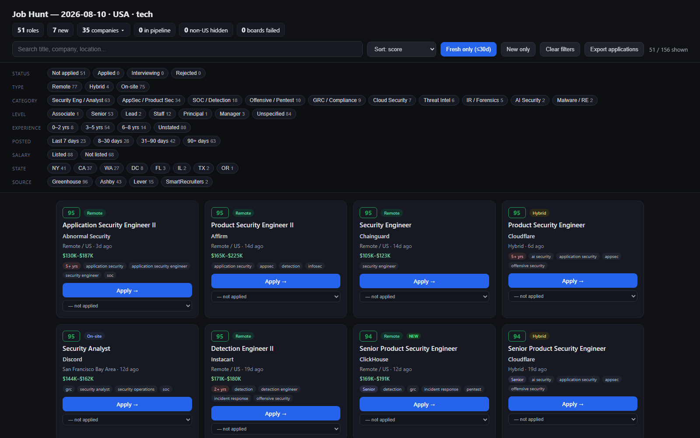
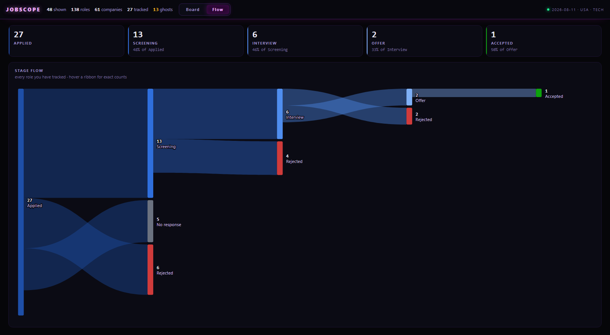

# 🎯 JobScope

[](https://github.com/canmenzo/jobscope/actions/workflows/ci.yml)


A USA tech job search that runs inside Claude Code. Tell it once what you want and hand it your resume, then say *"run my job hunt"* and a dashboard opens with fresh openings ranked by how good each one is **for you**, not by keyword match.

Postings come straight from company career pages and public job APIs. No LinkedIn, no Indeed, no scraping, no signup.

> ⚠️ It never applies to anything for you, and it doesn't write resumes or cover letters. It finds the jobs and keeps them organized. Applying is yours.



### ✨ Features
- 🔌 Pulls live postings from public ATS APIs (Greenhouse, Lever, Ashby, SmartRecruiters, Recruitee, Workday) plus The Muse, with optional Adzuna and USAJOBS keys
- 💯 Scores every role 0 to 100 on two things: is it the job you asked for, and could you realistically get it (years, level, pay, tools from your resume)
- 🏷️ Flags visa sponsorship (`SPONSORS` / `NO SPONSOR`) and ghost postings that sit open too long or get relisted
- 🗂️ Drag-and-drop pipeline: Will apply, Applied, Screening, Interview, Offer, plus a closed strip for accepted, rejected and no-response roles
- 📊 Flow tab showing where applications stall, and CSV export of the pipeline and the filtered list
- 🪟 Optional Windows shortcuts to run a hunt or reopen the last results without opening Claude Code

### 📦 Install

Needs [Claude Code](https://claude.com/claude-code) and [Python 3.11+](https://www.python.org/downloads/). In Claude Code:

```
/plugin marketplace add canmenzo/jobscope
/plugin install jobscope@jobscope
```

Then, in a normal terminal:

```
pip install requests pyyaml
```

Restart Claude Code.

<details>
<summary>🔧 Manual install, without the plugin system</summary>

The folder **must** be named `job-hunt`:

```bash
git clone https://github.com/canmenzo/jobscope.git ~/.claude/skills/job-hunt
cd ~/.claude/skills/job-hunt && pip install -r requirements.txt
```

Windows PowerShell:

```powershell
git clone https://github.com/canmenzo/jobscope.git "$env:USERPROFILE\.claude\skills\job-hunt"
```
</details>

### 🚀 Quick start

1. In Claude Code, say **set up my job hunt**. Claude asks a handful of questions; answer in plain English.
2. Say **run my job hunt**. The dashboard opens in your browser: your queue on the left, the pipeline on the right. Drag a job into the pipeline and it leaves the queue. Everything saves in your browser.

<details>
<summary>💬 What setup asks</summary>

- **What kind of tech work**: cybersecurity, software engineering, data/ML, devops/cloud, IT, product/design, QA. Pick as many as you want.
- **Which titles**: it suggests a list, and you can add your own.
- **Which companies**: say **all**. Useless boards are easy to hide later.
- **Your resume**: give it the file path; it pulls out your years, tools and certs itself.
- **Four things a resume can't tell it**: target salary, target levels, remote preference, and whether you need visa sponsorship.

That last group carries more weight than it looks. Skip the salary and it cheerfully recommends $250K principal roles. Skip the resume and it can still find jobs, but only tells you *"this matches what you asked for"*, never *"you could actually get this one."*

Everything is saved on your own machine. Nothing is uploaded anywhere.
</details>

<details>
<summary>🧭 Getting more out of the dashboard</summary>

- **Filters**: search, freshness (30 days, on by default), stage, remote, category, state, plus a **More** menu for level, experience, salary and sponsorship.
- **Every score has a reason.** Hover the number to see what pulled it up or down.
- **Right-click** a role to move it to any stage. Click a chip in the closed strip to see the roles behind it.
- **Flow tab**: where your applications actually die, and CSV export.


</details>

<details>
<summary>💯 What the 0-100 score means</summary>

Two questions at once: **is this the job you asked for**, and **could you realistically get it?**

The second half is why it wants your resume. A Staff Product Security Engineer role asking for eight years is a perfect title match for a second-year analyst and a complete waste of their afternoon.

🟢 Green you clear comfortably, 🟡 amber is a stretch, 🔴 red is a reach. Anything under 55 is hidden by default. See [the actual math](docs/how-it-works.md#the-score-0-100).
</details>

<details>
<summary>🪟 Windows: run it without opening Claude Code</summary>

Run `launcher\install-shortcut.ps1` once. You get two taskbar-pinnable shortcuts: one runs a fresh hunt, one reopens your last results.
</details>

### ⚙️ Configuration

You never have to touch a config file. Just say it:

| You want to... | Say this |
|---|---|
| Change titles, sectors, or resume details | *"reconfigure my job search"* |
| See more (or fewer) jobs | *"lower my job hunt min score to 45"* |
| Watch a specific company | *"add Cloudflare to my job hunt"* |
| Only show things you haven't seen | *"run my job hunt, new only"* |
| Reach smaller, regional employers | *"turn on Adzuna and USAJOBS"* |

Adzuna and USAJOBS need free API keys ([Adzuna](https://developer.adzuna.com/), [USAJOBS](https://developer.usajobs.gov/apirequest/)). Paste them to Claude and it wires them in. The config files themselves are described in [docs/how-it-works.md](docs/how-it-works.md#config-files).

<details>
<summary>🩹 If something goes wrong</summary>

**"It says NEEDS_SETUP."** Setup hasn't run yet. Say *"set up my job hunt."*

**"No jobs came back."** Filters are too tight. Lower the minimum score or turn off the 30-day freshness filter.

**"Some companies show as failed."** Normal. Companies move their job boards constantly, and one dead board never stops a run. Open the **companies** panel to see which, and prune them.

**"pip isn't recognized."** Python isn't on your PATH. Reinstall from [python.org](https://www.python.org/downloads/) and tick *"Add Python to PATH."*
</details>

### 🛠️ Development

```bash
pip install -r requirements.txt -r requirements-dev.txt
ruff check scripts tests
pytest -q
```

CI runs the same on Python 3.11 to 3.13. The scoring math, data sources and pipeline are covered in [How it works](docs/how-it-works.md).

### 📄 License

MIT (declared in `.claude-plugin/plugin.json`). Issues and PRs welcome.
