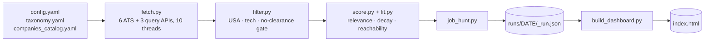

# How it works, for nerds

Everything the [README](../README.md) deliberately left out: where the postings
come from, how the score is actually computed, and how to work on the code.

[](https://github.com/canmenzo/jobscope/actions/workflows/ci.yml)

## The pipeline



A full sweep — ~250 boards, ~25k postings pulled, ~600 kept — takes about 90
seconds. Each board is fetched in its own thread with its own try/except, so one
dead board never kills a run. Already-surfaced roles are tagged rather than
hidden; `seen_jobs.json` tracks them across runs.

Drive it directly instead of through Claude:

```bash
python scripts/job_hunt.py                 # full run
python scripts/job_hunt.py --limit 10      # cap companies (testing)
python scripts/job_hunt.py --pick greenhouse:stripe,ashby:workos
python scripts/job_hunt.py --new-only      # only roles unseen on prior runs
python scripts/job_hunt.py --min-score 45  # override config
python scripts/build_dashboard.py          # build + open the web app (--no-open, or a date)
```

Missing config makes `job_hunt.py` print `NEEDS_SETUP` and exit 2.

## Where the postings come from

Six ATS APIs fetched **by company** — Greenhouse, Lever, Ashby,
SmartRecruiters, Recruitee, Workday — plus three APIs queried **by role**: The
Muse, Adzuna, USAJOBS. All official, public, documented JSON endpoints. Nothing
is scraped, and LinkedIn/Indeed are not touched.

The by-role sources matter more than they look. A hand-curated catalog of
security vendors and AI labs only ever returns security vendors and AI labs;
query APIs are how the regional bank, the hospital system, the university and
the 40-person MSP show up at all.

## The score (0-100)

### Relevance — is this the kind of job you asked for?

A selected title phrase appearing in the job title scores **72-100**, scaling
with coverage, so a clean "Detection Engineer" outranks "Staff Distributed
Systems Detection Engineer, Platform". A sub-sector keyword in the title scores
**55-63**. A description-only match scores **42**. Counting more keywords never
inflates it.

Opt-in penalties then decay stale postings (`freshness`) and mark down levels
(`downrank_levels`, `exclude_levels`) and years above your bar (`max_yoe`).

### Fit — could you realistically get it?

Relevance alone recommends jobs you cannot get: a Staff Product Security
Engineer wanting 8 years scores 95 to a second-year analyst, because the title
matches.

| Component | Weight | What it reads |
|---|---|---|
| Experience | 40 | Years the posting asks for vs yours |
| Seniority | 25 | The title's level vs the levels you target |
| Skills | 25 | How much of your toolkit the posting actually names |
| Pay band | 10 | A listed floor far above your target signals a senior role |

Two rules keep fit honest.

**Missing data scores zero.** About half of all postings state no years and no
salary, and rewarding that silence floated the least informative listings to the
top. What a posting doesn't state now earns nothing, and the reasons name the
deduction — the weights sum to 100, so no pay range is −10 and no readable
description is −25. Only an unstated years bar is still inferred, from what the
title implies.

**Common skills are not evidence.** `python`, `git` and `docker` appear in
almost every posting, so each run weights your skills by how rare they are in
the postings it pulled, with full marks pegged to the top decile of that run's
own matches.

The displayed score blends both, weighted toward fit, and the chip is tinted by
reachability. Default `min_score` is **55**.

## Config files

Setup writes `config/config.yaml` and `config/profile.yaml`. Both are
git-ignored, along with your pipeline and every run. Schemas live in
`config/config.example.yaml` and `config/profile.example.yaml`; copy them to
configure by hand instead of conversationally. Without a profile, the score is
relevance only.

### Companies

`config/companies_catalog.yaml`, grouped by ATS. The slug is the identifier in
that ATS's public URL:

| Source | URL shape |
|---|---|
| Greenhouse | `job-boards.greenhouse.io/<slug>` |
| Lever | `jobs.lever.co/<slug>` |
| Ashby | `jobs.ashbyhq.com/<slug>` |
| SmartRecruiters | `jobs.smartrecruiters.com/<slug>` |
| Recruitee | `<slug>.recruitee.com` |

Workday is `tenant:wdN:site`, read off the careers URL — so
`https://capitalone.wd12.myworkdayjobs.com/Capital_One` becomes
`capitalone:wd12:Capital_One`.

A failing slug never crashes the run, and the catalog keeps a commented list of
slugs already probed and confirmed dead.

### Broad sources

Sources with no key are skipped silently:

```yaml
broad_sources:
  muse: true            # The Muse — no key needed
  adzuna: false         # free key: https://developer.adzuna.com/
  usajobs: false        # free key: https://developer.usajobs.gov/apirequest/

broad_queries:          # defaults to `titles`; plainer phrasing works better
  - SOC Analyst
  - Information Security Analyst
```

## The dashboard

Vanilla JS in one self-contained file — no build step, no framework, no network
calls. A dense sortable list on the left, a drag-and-drop kanban on the right
(Applied · Screening · Interview · Offer, plus a closed strip). The list is a
triage queue, so a role leaves it once you track it; every move raises an Undo
toast, and stage history is timestamped into `localStorage`, seeded from
`applications.json` if present.

- **Filters** — search, Fresh ≤30d (on by default), Stage, Type, Category,
  State and More (Level, Experience, Posted, Salary, Source, Company,
  Sponsorship). Searchable multi-selects; OR within a group, AND across groups,
  persisted to the URL hash.
- **State** answers what Type can't. A role remote *anywhere* in the US is tied
  to no state, so it sits at the top of the menu as **Remote / US** rather than
  vanishing the moment you pick one.
- **Coverage sheets** — the *companies* and *sources* stats open a list of
  every board searched and every provider available, including the ones that
  came back empty or are switched off, with the reason. A source waiting on a
  free API key looks exactly like a source with no jobs otherwise.
- **GHOST** tags flag reqs left open unusually long or relisted under a new id;
  **NO SPONSOR** / **SPONSORS** flag what the description says about visas; the
  same role posted to five cities is merged into one row.
- **Flow tab** — a conversion strip over a Sankey of how roles actually moved,
  with drop-offs branching where they happened. Pipeline and Roles CSV exports
  sit in its header.

## Development

```bash
pip install -r requirements.txt -r requirements-dev.txt
pytest -q                  # 191 tests
ruff check scripts tests
```

CI runs both on every push against Python 3.11, 3.12 and 3.13.
